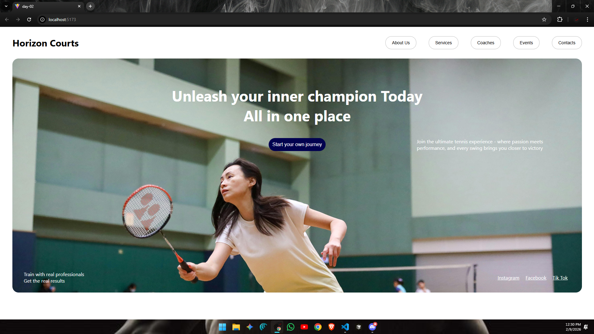

# ⚛️ React Learning Series – Day 02

* Welcome to **Day 02** of my **React Learning Series**  
* On this day, I focused on understanding **React components**, **project structure**, and building a **small UI using reusable components**.
* Built a **small React UI** with a **navigation bar and a centered hero section**.

## 📘 What I Learned :

- How to create **multiple React components**
- How to organize components using a `components` folder
- Understanding **component based architecture**
- Using **JSX** to build UI
- Importing and using components inside `App.jsx`
- Applying **CSS styling** to React components

-----------------------
## 🖼️ UI Preview



-----------------------

## 📂 Folder Structure (day-02) :
```
day-02/
├── node_modules/ 
├── public/ 
├── src/ 
│ ├── assets/ 
│ ├── components/      # Contains reusable React UI components
│ │ ├── Center.jsx     # Center section component used to display main content/image
│ │ └── Navbar.jsx     # Navigation bar component for top menu links
│ ├── App.jsx          # Root component that combines all UI components
│ ├── index.css        # Global CSS styles applied to the entire app
│ └── main.jsx         # Entry point that renders the React app to the DOM
├── .gitignore 
├── eslint.config.js 
├── index.html
├── package.json 
├── package-lock.json 
├── README.md 
└── vite.config.js 
```
