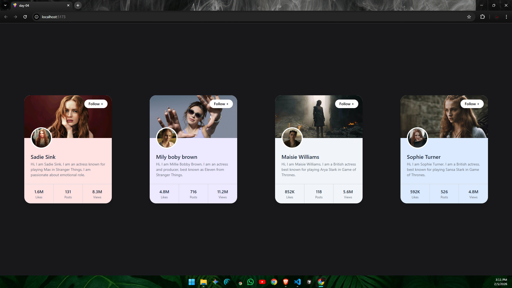

# ⚛️ React Learning Series – Day 04

* Welcome to **Day 04** of my **React Learning Series**  
* On this day, I focused on understanding one of the most important React concepts **Props**.
* I learned how **data flows from one component to another**, how to pass **Tailwind CSS styles through props**, and how to build a **profile card UI using array data**.

---

## 📘 What I Learned :

- What **props** are in React
- What **props drilling** means
- How data flows from **parent → child component**
- Passing **Tailwind CSS classes through props**
- Using **array of objects** to render multiple cards
- Creating a **profile card UI**
- Displaying dynamic data like:
  - Name
  - Background image
  - Profile image
  - Likes
  - Posts
  - Views

---

## 🖼️ UI Preview

Below is the **profile card UI** created using **React + Tailwind CSS**:



The UI is built using **reusable Card components** and **props based data rendering**.

---

## Core Concept: Props & Data Flow

In React:
- **Props** are used to pass data from one component to another
- Data flows **one way** (Parent ➝ Child)
- Props make components **reusable and dynamic**

---

## 📂 Folder Structure (day-04):
```
day-04/
├── node_modules/ 
├── public/
│ └── Card-UI.png      # Screenshot of the profile card UI
├── src/
│ ├── assets/
│ ├── Card.jsx         # Card component that receives data via props
│ ├── App.jsx          # Parent component that sends data to Card
│ ├── index.css        # Global styles and Tailwind directives
│ └── main.jsx         # Entry point that renders the React app
├── .gitignore 
├── eslint.config.js 
├── index.html 
├── package.json 
├── package-lock.json 
├── README.md # Documentation for Day 04
└── vite.config.js 
```