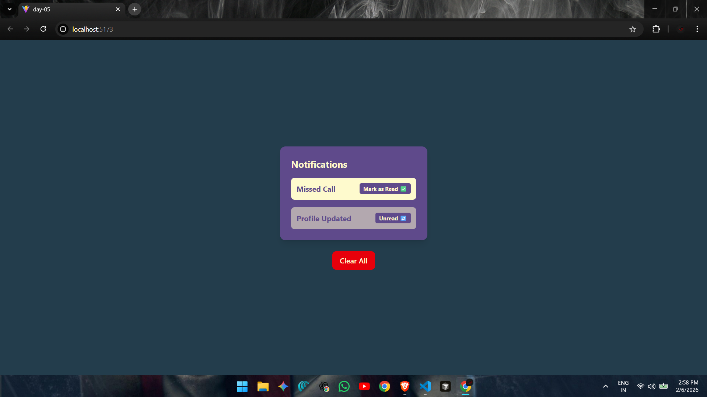
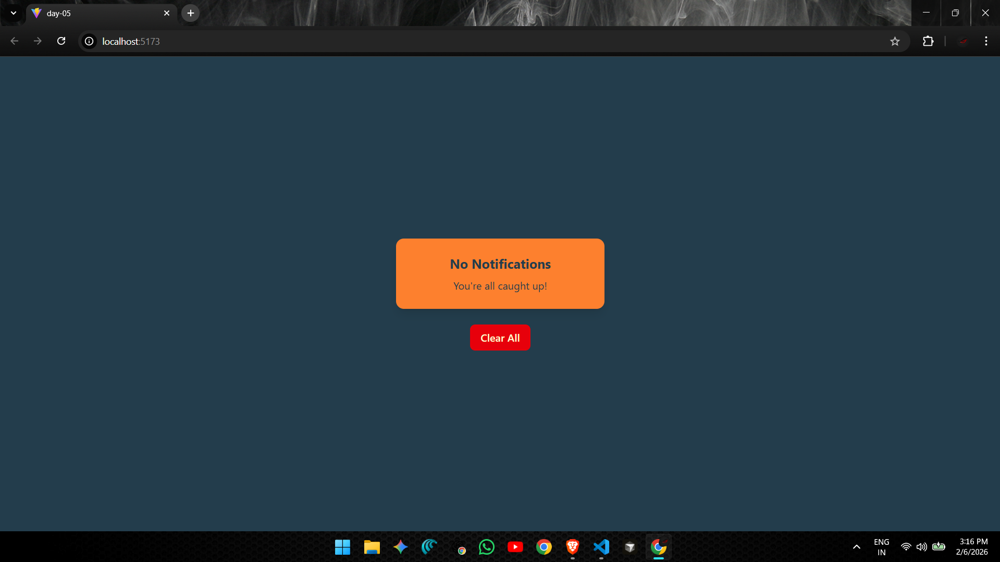

# ⚛️ React Learning Series – Day 05

* Welcome to **Day 05** of my **React Learning Series**.   
* Today’s focus was on combining multiple core React concepts together and understanding how they work **in a real UI flow**, instead of learning them in isolation.
* To practice this, I built a **simple notification panel UI** using **React + Tailwind CSS**.

---

## What I Learned :

On this day, I learned how to **integrate multiple React concepts at the same time**, including:

- Using **`useState`** to manage UI state
- Passing data using **props drilling**
- Applying **conditional rendering** based on state
- Structuring UI using **multiple reusable components**
- Styling the UI using **Tailwind CSS**
- Handling **empty states** in UI properly

---

## 🖼️ UI Overview

Below is the **preview of the notification panel UI** created during this practice:




The UI is intentionally kept **simple and minimal**, so the main focus stays on **React logic and data flow**, not design complexity.

(Preview image available as `demo.png` and `demo1.png` in the `public` folder.)

---

## 🧠 Core Concepts Used Together

### 1. `useState`
Used to store and update:
- Notifications data
- Read / unread status
- Empty state after clearing notifications

---

### 2. Props Drilling :
Data and handlers are passed from:
App.jsx → NotificationList.jsx → EmptyState.jsx


This helped me clearly understand how **data flows from parent to child components**.

---

### 3. Conditional Rendering :
UI changes based on state:
- Show notifications when data exists
- Show empty state when notifications are cleared
- Toggle read / unread status dynamically

---

## 📂 Folder Structure (day-05):
```
day-05/
├── node_modules/ 
├── public/
│ └── demo.png                  # UI preview image
├── src/
│ ├── assets/ 
│ ├── components/
│ │ ├── EmptyState.jsx          # UI shown when no notifications exist
│ │ └── NotificationList.jsx    # Displays list of notifications
│ ├── App.jsx                   # Main logic and state management
│ ├── index.css                 # Global styles and Tailwind setup
│ └── main.jsx 
├── .gitignore 
├── eslint.config.js 
├── index.html 
├── package.json 
├── package-lock.json 
├── README.md # Day 05 documentation
└── vite.config.js 
```