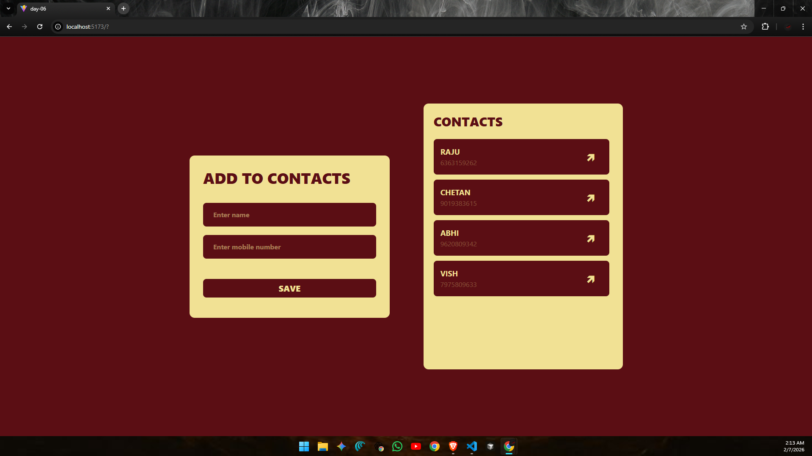
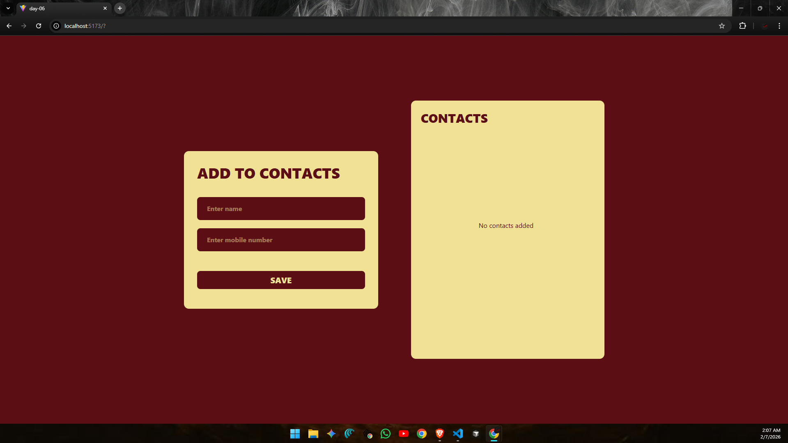

# ⚛️ React Learning Series – Day 06

* Today i focused on building an **interactive form driven UI** and understanding how user input flows through a React application.  
* To practice this, I created a **basic contact list application** using **React state, controlled inputs, and Tailwind CSS**.

---

# 📘 What I Learned :

- Handling form submissions in React
- Managing input values using useState
- Using controlled inputs (two way binding)
- Updating the UI dynamically on user actions
- Rendering data from an array state
- Showing a clean empty state UI
- Styling components using Tailwind CSS

---

## 🖼️ UI Preview

### Contact Form & List Layout


### Empty State View


---

## 🧠 Core Learning Highlights

### 1. Form Handling :
The form captures user input and prevents page reload using a submit handler.  
On submission, a new contact is added to state and inputs are reset.

---

### 2. Two-Way Binding :
Both input fields are **controlled components**, meaning:
- Input value comes from state
- State updates on every keystroke

This creates a clear connection between **UI and data**.

---

### 3. Dynamic Contact List :
- Contacts are stored in an array
- New entries are appended using spread syntax
- The list updates instantly after form submission

---

### 4. Empty State Handling :
When there are no contacts, the UI displays a clear message instead of an empty layout.  
This improves user experience and keeps the interface meaningful.

---

## 📂 Folder Structure (day-06):
```
day-06/
├── node_modules/ 
├── public/
│ ├── demo1.png        # Main UI preview
│ └── demo2.png        # Empty state preview
├── src/
│ ├── assets/ 
│ ├── App.jsx          # Main component with form & list logic
│ ├── index.css        # Tailwind setup and global styles
│ └── main.jsx 
├── .gitignore 
├── eslint.config.js 
├── index.html 
├── Notes.md           # notes
├── package.json 
├── package-lock.json 
├── README.md          # Day-06 documentation
└── vite.config.js 
```