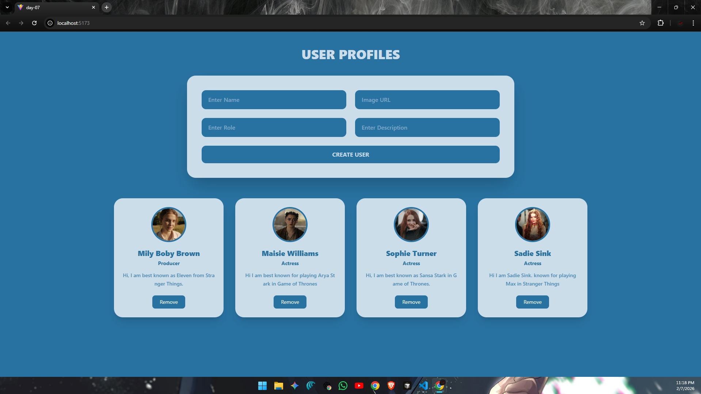

# ⚛️ React Learning Series – Day 07

* Today i focused on understanding **localStorage** and how it can be used inside a React application to **persist data**.  
* To practice this properly, I built a small **user profile UI** that combines **form handling, component reuse, and persistent storage**.

This session helped me connect multiple concepts and see how React behaves in a more **realistic app scenario**.

---

## 📈 What I Built :

A **User Profile Manager UI** where:

- User details are entered through a form
- Profiles are displayed as individual cards
- Data is stored in **localStorage**
- Profiles remain available after page refresh
- Users can be removed dynamically

The goal was not design complexity, but **logic clarity and data flow**.

---

## 🖼️ UI Preview

### Snapshot


### Working Demo


---

## 🧠 Main Learning Focus (Day-07)

### 1. LocalStorage 
- User data is saved to `localStorage`
- Data is loaded automatically when the app starts
- UI stays in sync with stored data
- Changes are reflected immediately after add/remove actions

This helped me understand how React apps can **retain data beyond refreshes**.

---

### 2. Form Handling
- Multiple input fields are controlled using state
- Form submission is handled safely without page reload
- Inputs are cleared after successful submission

---

### 3. State Driven UI Updates
- Profiles are stored in an array state
- UI updates automatically when state changes
- Cards are rendered dynamically using `.map()`

---

### 4. Reusable Card Component
- Each profile is displayed using a reusable `Card` component
- Data and actions are passed via props
- UI remains clean and scalable

---

### 5. Controlled Delete Flow
- Each card includes a remove action
- A confirmation step ensures safe deletion
- Updated data is synced back to localStorage

---

## 📂 Folder Structure (day-07) :

```
day-07/
├── node_modules/ 
├── public/
│ ├── demo_img.png       # UI screenshot
│ └── demo_vid.mp4       # Demo video
├── src/
│ ├── assets/ 
│ ├── components/
│ │ └── Card.jsx         # Reusable user card component
│ ├── App.jsx            # Form logic + state + localStorage
│ ├── index.css          # Global styles & Tailwind setup
│ └── main.jsx 
├── .gitignore 
├── eslint.config.js 
├── Notes.md             # notes
├── index.html 
├── package.json 
├── package-lock.json 
├── README.md            # Day 07 documentation
└── vite.config.js
```
