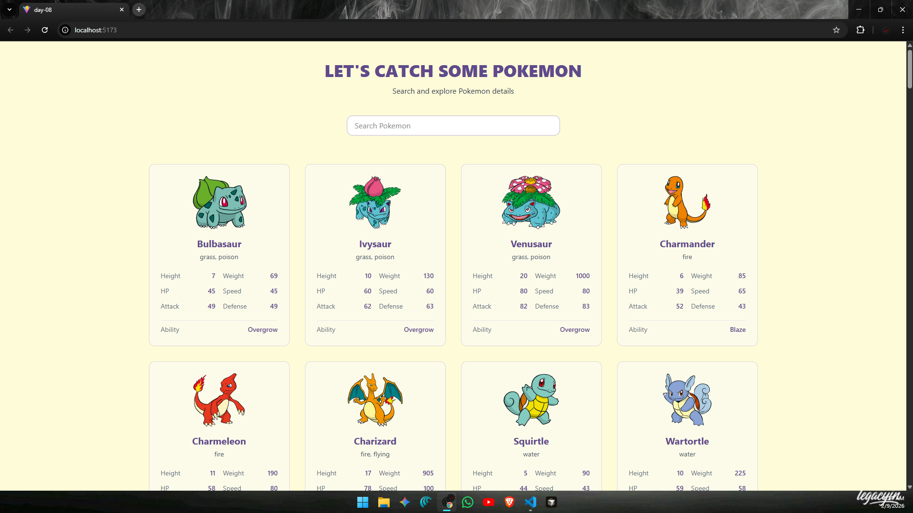
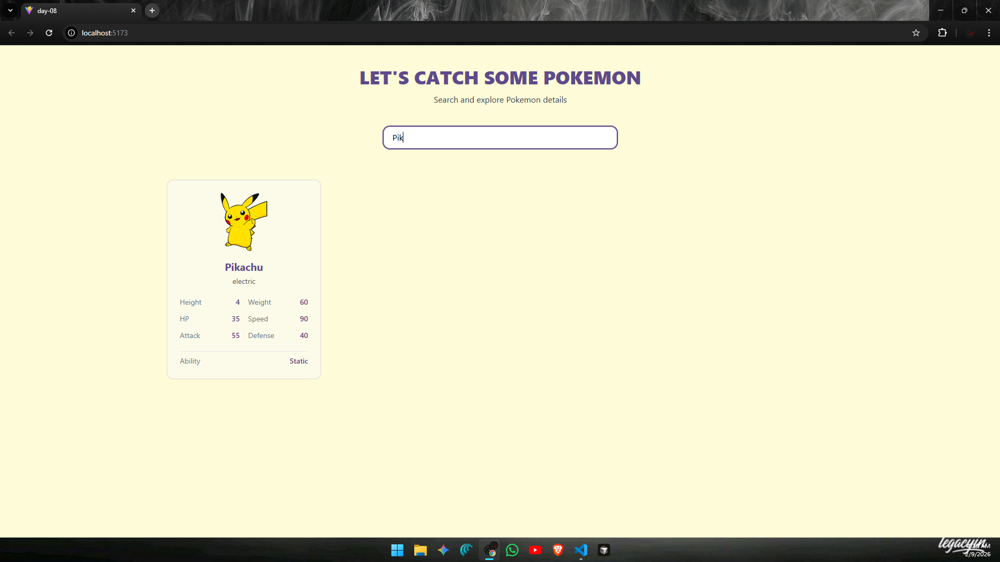

# ⚛️ React Learning Series – Day 08

* Today i focused on working with **external APIs** and handling **side effects** in React.  
* I learned how to fetch real world data using **Axios**, manage API calls with **useEffect**, and display structured results in a clean UI.

To practice this, I built a **Pokemon Explorer UI** that fetches and displays data for **100 Pokemon** from the public **PokeAPI**.

---

## 📈 What I Built :

A simple structured **Pokemon listing application** with:

- Data fetched from an external API
- Detailed Pokemon cards
- Search functionality
- Loading and error handling
- Clean, responsive UI using Tailwind CSS

The goal was to understand **data fetching flow in React**, not just UI design.

---
### 🌐 **Live Link** :  https://pokestudio.vercel.app/
---

## 🖼️ UI Preview

### Main Listing View


### Search Results View


---

## 🧠 Key Learnings from Day 08

### 1. useEffect for Side Effects
- API calls are handled inside `useEffect`
- Data is fetched only once when the component mounts
- Helped me understand **when and why useEffect runs**

---

### 2. Axios for API Requests
- Axios is used to fetch the main Pokemon list
- Cleaner syntax and better readability than plain fetch
- Makes handling API responses easier

---

### 3. Fetching Detailed Data
- Initial API provides basic Pokemon info
- Individual Pokemon details are fetched using their URLs
- `Promise.all()` is used to resolve multiple async requests together

---

### 4. Loading & Error States
- A loading screen is shown while data is being fetched
- Errors are handled gracefully and displayed to the user
- Improves reliability and user experience

---

### 5. Search Functionality
- Real time filtering based on Pokémon name
- Case insensitive search
- Implemented using array `.filter()` on fetched data

---

### 6. Component Separation
- `Pokemon.jsx` handles logic, API calls, and state
- `PokeCard.jsx` focuses only on UI presentation
- This separation made the code easier to read and maintain

---

## 📂 Folder Structure (day-08) :
```
day-08/
├── node_modules/ 
├── public/
│ ├── demo1.png            # UI preview image
│ └── demo2.png            # UI search preview
├── src/
│ ├── assets/ 
│ ├── components/
│ │ ├── PokeCard.jsx       # Pokemon card UI component
│ │ └── Pokemon.jsx        # Data fetching & main logic
│ ├── App.jsx              # App entry component
│ ├── index.css 
│ └── main.jsx 
├── Notes(Axios).md        # Axios notes
├── Notes(useEffect).md    # useEffect notes
├── .gitignore 
├── eslint.config.js 
├── index.html 
├── package.json 
├── package-lock.json 
├── README.md              # Day-08 documentation
└── vite.config.js 
```
