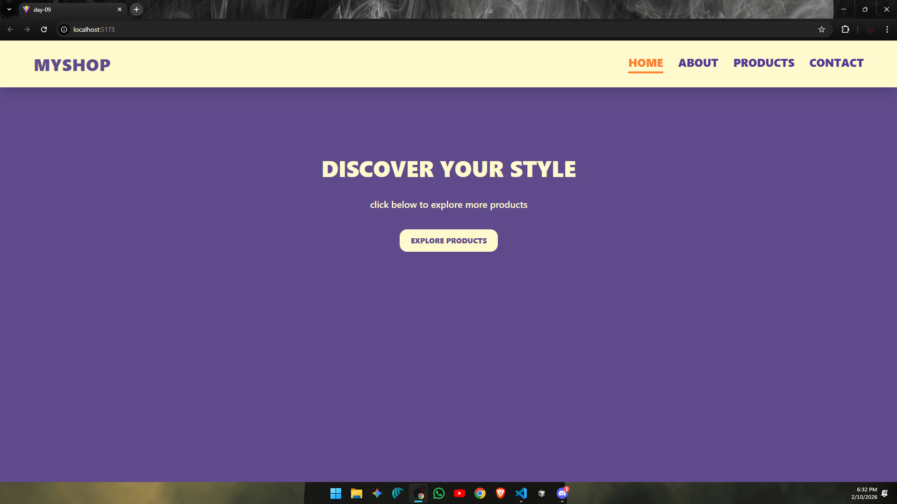
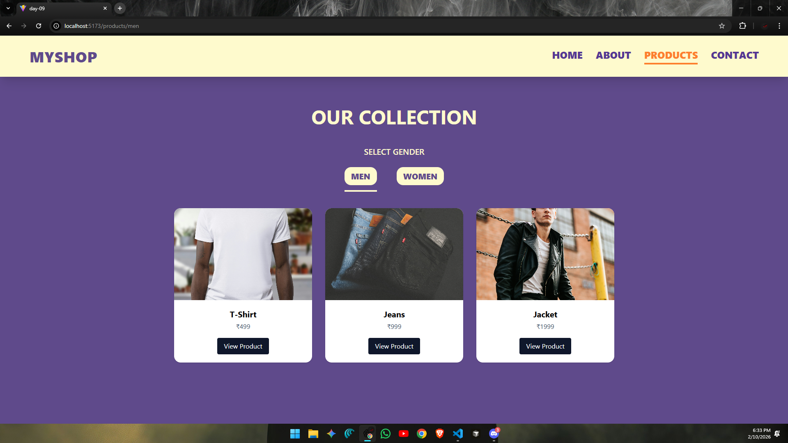
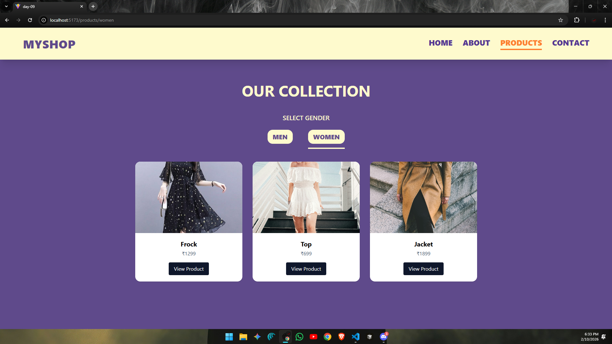

# ⚛️ React Learning Series – Day 09

* Today I focused on learning **client side routing in React** using **React Router DOM**.  
* Today I built a **multi page shopping UI** where navigation happens without page reloads, just like a real single page application.

---

## 📈 What I Built

A simple **shop style application** with multiple pages and nested routes, including:

- Home page with programmatic navigation
- About and Contact pages
- Products section with nested routes
- Separate Men and Women product listings
- Active navigation highlighting
- Clean layout styled using Tailwind CSS

This helped me understand how **real websites handle navigation in React**.

---

## 🖼️ UI Preview

### Home & Navigation


### Products & Nested Routes


### Men / Women Listings


---

## 🧠 Key Learnings from Day 09

### 1. BrowserRouter Setup
- Wrapped the app with `BrowserRouter` at the root level
- Enabled routing across the entire application

---

### 2. Routes & Route Components
- Used `Routes` and `Route` to define page paths
- Each page renders based on the current URL
- Helped understand URL based UI rendering

---

### 3. Navbar with NavLink
- Navigation menu created using `NavLink`
- Active route is visually highlighted
- Improved user experience and clarity

---

### 4. Programmatic Navigation
- Used `useNavigate` to move between pages using buttons
- Navigation triggered by user actions, not only links

---

### 5. Nested Routing (Products → Men / Women)
- Products page acts as a parent route
- Men and Women pages are rendered using nested routes
- `Outlet` is used to display child routes inside Products layout

---

### 6. Page Based Component Structure
- Pages are separated into a dedicated `pages` folder
- Components like Navbar are reused across pages
- Improved readability and scalability

---

## 📂 Folder Structure (day-09) :
```
day-09/
├── node_modules/ 
├── public/
│ ├── demo1.png          # Home page preview
│ ├── demo2.png          # Products page preview
│ └── demo3.png          # Category listing preview
├── src/
│ ├── assets/ 
│ ├── components/
│ │ └── Navbar.jsx       # Navigation bar component
│ ├── pages/
│ │ ├── Home.jsx         # Landing page
│ │ ├── About.jsx        # About page
│ │ ├── Contact.jsx      # Contact page
│ │ ├── Products.jsx     # Parent products route
│ │ ├── Men.jsx          # Men category (nested route)
│ │ └── Women.jsx        # Women category (nested route)
│ ├── App.jsx            # Route configuration
│ ├── index.css 
│ └── main.jsx           # React entry point with BrowserRouter
├── .gitignore 
├── eslint.config.js 
├── index.html 
├── package.json 
├── package-lock.json 
├── README.md             # Day-09 documentation
├── Router-DOM(Notes)     # Router-DOM notes
└── vite.config.js 
```
