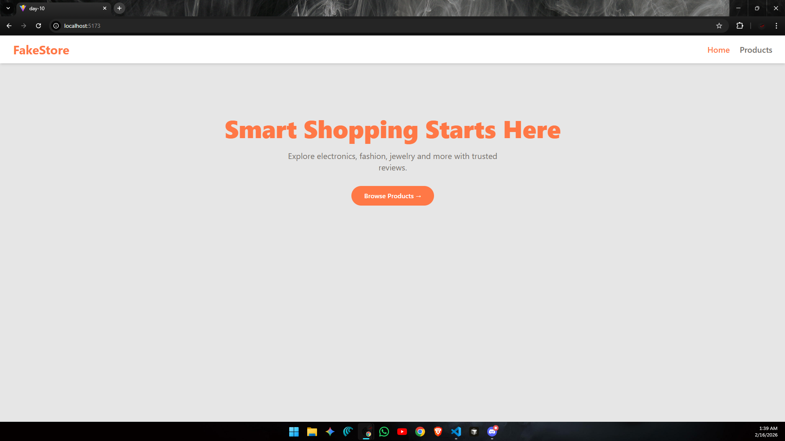
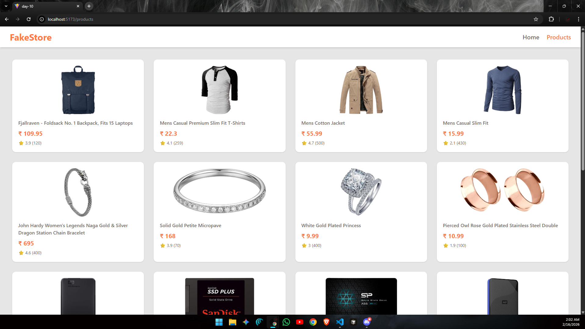
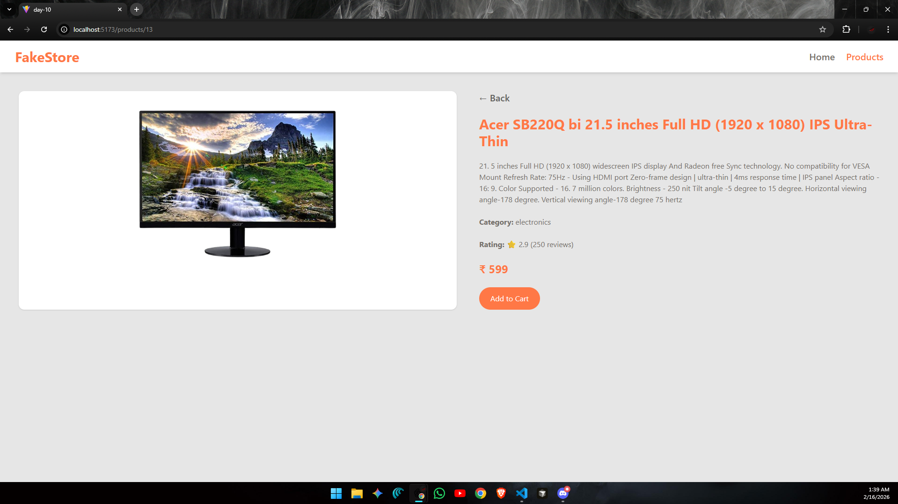

# ⚛️ React Learning Series – Day 10

* Today i focused on understanding and implementing the **React Context API** to manage and share global state across the application.

* To practice this concept properly, I built a small **FakeStore e-commerce UI** using real product data from an external API. The goal was to remove prop drilling and make product data accessible anywhere in the app using Context.

---

## 📈 What I Built

A small store application that includes:

- Home page
- Products listing page
- Dynamic product details page
- Global product data using Context API
- Data fetched from FakeStore API
- Clean UI styled with Tailwind CSS

This helped me understand how real world applications manage shared data efficiently.

---

## 🖼️ UI Preview

### Home Page


### Products Listing


### Product Details


---
## Why Context API?

Instead of passing product data through multiple components using props, I used **Context API** to:

- Store products globally
- Access products anywhere in the component tree
- Avoid unnecessary prop drilling
- Keep state management cleaner

---
## 🧠 Key Learnings from Day 10

### 1️. ProductDataContext
Created using `createContext()` to define a global data container.

### 2️. ProductContext (Provider Component)
- Fetches products using `useEffect`
- Stores products in state
- Wraps the entire app
- Provides product data to all child components

```js
<ProductDataContext.Provider value={products}>
  {props.children}
</ProductDataContext.Provider>
```

### 3️. Consuming Context with useContext
In `Products.jsx` and `ProductDetails.jsx`, product data is accessed using:
```js
const products = useContext(ProductDataContext);
```
This makes product data instantly available without passing props manually.

---

## API Integration
- Product data fetched from FakeStore API
- API call handled inside Context Provider
- Data loads once when app initializes
- Loading state handled gracefully in UI
This made the application behave like a real store pulling live data.

---

## Dynamic Routing
- `/products` → Shows all products
- `/products/:productId` → Shows specific product details
- `useParams()` used to extract product ID
- `useNavigate()` used for back navigation
Each product card links to its own dynamic details page.

---

## 📂 Folder Structure (day-10) :
```bash
day-10/
├── node_modules/
├── public/
│   ├── demo1.png                  # Home page preview image
│   ├── demo2.png                  # Products page preview image
│   └── demo3.png                  # Product details preview image
├── src/
│   ├── api/
│   │   └── FakeStoreApi.js            # API fetching logic
│   ├── components/
│   │   └── Navbar.jsx                 # Navigation bar
│   ├── context/
│   │   ├── ProductContext.jsx         # Context Provider
│   │   └── ProductDataContext.jsx     # Context creation
│   ├── pages/
│   │   ├── Home.jsx                   # Landing page
│   │   ├── Products.jsx               # Product listing page
│   │   └── ProductDetails.jsx         # Individual product details page
│   ├── App.jsx                        # Route configuration
│   ├── main.jsx                       # Wrapped with Router + Context
│   └── index.css
├── Notes(ContextAPI).md               # Context API Notes 
├── README.md                          # Day-10 documentation
└── vite.config.js

```